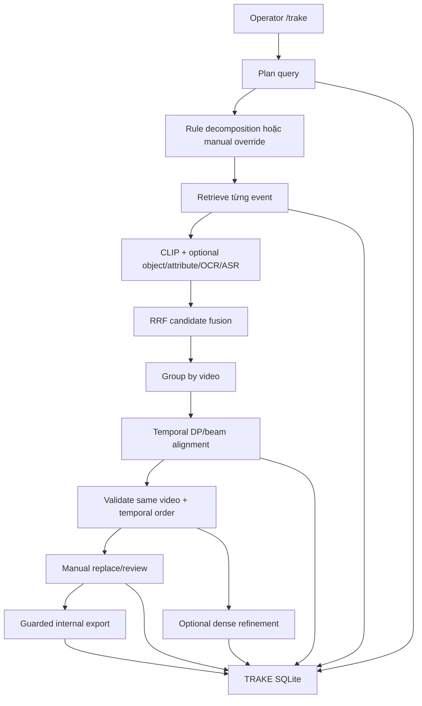

# TRAKE Phase 8 — LLM Handoff và trạng thái dự án

> Snapshot kỹ thuật cho LLM/agent tiếp theo. Mục tiêu là hiểu đúng code, dữ liệu, giới hạn và bước tiếp theo; không suy diễn chất lượng hệ thống chỉ từ việc test pass.

## 1. Kết luận ngắn

Phase 8 TRAKE đã có baseline chức năng local trên L21: tách query thành event, retrieve candidate từng event, gom theo video, temporal alignment, UI `/trake`, SQLite persistence, review thủ công, internal export và dense refinement theo event đã chọn.

Tuy nhiên, trạng thái chính xác là **IMPLEMENTATION COMPLETE — QUALITY/HOLDOUT VERIFICATION PENDING**, chưa phải `DONE`:

- Development và holdout chưa có nhãn thủ công.
- Mọi metric chất lượng hiện là `null/unavailable`.
- EasyOCR đang chạy dở và chưa được rebuild vào SQLite runtime.
- Browser E2E smoke chưa có bằng chứng mới; port 8765 không chạy khi snapshot.
- P8.7 VLM/API tắt có chủ đích.
- Internal export không phải format nộp BTC.

Không được tuyên bố hệ thống có accuracy tốt, đã pass holdout, OCR đã usable, hoặc sẵn sàng submit chính thức.

## 2. Snapshot metadata

| Trường | Giá trị |
|---|---|
| Date | 19-08-2026, khoảng 22:59 UTC+07:00 |
| Branch | `Phuoc1` |
| HEAD | `1c4e112c849d447a5242fa7fcada63d3237206b5` |
| Commit | `phase 8 baseline` |
| Scope | L21 only |
| Report trước | `reports/Phase_8_19-08-2026_8.md` |
| Focused TRAKE tests | 38 passed in 4.04s |
| Full repository tests | 226 passed in 6.62s |
| JS syntax | `node --check web/trake_ui/app.js` PASS |

Git state khi kiểm tra:

```text
 M reports/Phase_2_15-08-2026_6.md
?? .venv-ocr/
```

Đây là thay đổi có trước; không reset/xóa/commit chúng khi làm Phase 8.

## 3. Nguồn sự thật và mâu thuẫn tài liệu

Thứ tự tin cậy theo `.agent/codex.md`:

1. Quy định BTC mới nhất (khi liên quan luật cuộc thi).
2. Report mới nhất của phase.
3. Decision log đã duyệt.
4. Report được dẫn chiếu.
5. Plan.
6. README.
7. Comment/tài liệu cũ.
8. Suy luận agent.

Các mâu thuẫn đã thấy:

- `Project_Status_19-08-2026_1.md` có đoạn “Phase 8 chưa triển khai”; đây là snapshot cũ hơn code/commit hiện tại.
- README phần đầu nói Phase 8 complete/quality pending, nhưng phần lịch sử phía dưới vẫn nói “chưa có TRAKE”.
- README ghi 188 tests, kiểm tra hiện tại là 226.
- README ghi object store 780,000 detections; SQLite thực tế có 621,200 detections.
- Report P8.8 nói OCR partial 725 records ở audit cũ; snapshot hiện tại có 5,299/7,800 record và process còn chạy.

Ưu tiên code, test, artifact runtime và file này; không dựa riêng README/Project_Status cũ.

## 4. Mục tiêu và scope

TRAKE cần tìm một video chứa chuỗi event, rồi chọn keyframe semantic cho từng event đúng thứ tự thời gian.

Invariant bắt buộc:

- Chain chỉ có một `video_id`.
- Event required phải có candidate.
- `pts_time` tăng nghiêm ngặt, trừ khi request bật `allow_same_frame`.
- Hệ thống giữ nhiều chain candidate.
- Manual replacement phải validate lại invariant trên server.
- Thiếu video/scorer phải trả refinement unavailable rõ ràng; keyframe chain gốc vẫn hợp lệ.

Scope hiện tại:

- `L21` duy nhất.
- 1–5 event/query.
- CLIP NumPy retrieval là nền tảng.
- Object, attribute, OCR, ASR là opt-in theo event/runtime availability.
- Raw L21 video chỉ dùng cho refinement on-demand.
- Core local, không gọi VLM/API.

Ngoài scope:

- L22–L30 TRAKE.
- FAISS/vector database.
- Corpus-wide dense decoding/re-encode.
- Auto-confirm.
- Official BTC serializer.
- Relevance benchmark đã gán nhãn.

## 5. Kiến trúc



Runtime integration nằm trong `src/aic_retrieval/retrieval_ui.py`; core Phase 8 tách thành các module `trake_*.py`.

## 6. Module map

| File | Trách nhiệm |
|---|---|
| `src/aic_retrieval/trake_schema.py` | Contract/version/validation request-event |
| `src/aic_retrieval/trake_decomposition.py` | Rule split query + manual override |
| `src/aic_retrieval/trake_candidates.py` | Typed candidates, rank normalization, video grouping |
| `src/aic_retrieval/trake_scoring.py` | Score config và score breakdown |
| `src/aic_retrieval/trake_alignment.py` | Same-video temporal DP/beam, validate chain |
| `src/aic_retrieval/trake_workflow.py` | plan/search/align/update/replace/review/export |
| `src/aic_retrieval/trake_store.py` | SQLite current-state + audit rows |
| `src/aic_retrieval/trake_refinement.py` | Bounded OpenCV decode + local CLIP refinement |
| `src/aic_retrieval/retrieval_ui.py` | Service integration và `/api/trake/*` routes |
| `tools/retrieval_ui.py` | Server CLI |
| `tools/phase8_fixture_benchmark.py` | Synthetic plumbing fixture |
| `tools/phase8_benchmark.py` | Development/holdout evaluator |
| `web/trake_ui/*` | TRAKE web workspace |
| `tests/test_trake_*.py` | Contract, DP, API, store, UI-static, benchmark, refinement |

## 7. Domain contract và decomposition

Schema version: `phase8-trake-v1`.

Supported group: `{L21}`.

Supported modality: `clip`, `object`, `attribute`, `ocr`, `asr`, `metadata`.

`TrakeRequest` reject:

- query id/query trống;
- event count ngoài 1–5;
- duplicate event id;
- duplicate/non-contiguous order;
- event không được lưu theo temporal order;
- group ngoài L21;
- schema version không hỗ trợ.

`TrakeEvent` có `event_id`, `order`, `text`, `clip_query`, `modalities`, `required`, structured constraints, min/max gap, confidence, source.

Rule decomposer:

- Split connector rõ: `→`, `sau đó`, `rồi`, `tiếp theo`, `then`, `after that`, `followed by`.
- Support `trước khi`/`before`.
- Temporal hint mơ hồ tạo `DECOMPOSITION_REVIEW_REQUIRED`.
- Không dùng external LLM/API, deterministic.
- Manual override đánh dấu source `manual`.

Giới hạn:

- Decomposer không tự suy luận object/OCR/ASR/attribute constraints.
- Event default chỉ dùng modality `clip`.
- UI cho sửa text, required và modality list; chưa có editor constraint payload cho object/attribute.

## 8. Candidate retrieval

Defaults:

| Parameter | Giá trị |
|---|---:|
| Event pool | 60, allowed 30–100 |
| Max candidates/video/event | 8, allowed 5–10 |
| Video pool | 20, allowed 10–30 |

Luồng `_trake_retrieve_event`:

1. CLIP: encode `event.clip_query`, search NumPy top-N.
2. Object: chỉ dùng nếu object service có và event có `object_constraints`.
3. Attribute: chỉ dùng nếu service có và có color constraint.
4. OCR: Phase 5 FTS khi Phase5 service available và event chọn OCR.
5. ASR: Phase 5 FTS khi event chọn ASR.
6. Hit map về `(video_id, keyframe_id)` trong index ref; không map được thì bỏ.
7. Nhiều modality cùng keyframe fuse RRF:

```text
rrf_score = Σ 1 / (60 + modality_rank)
```

8. Adapter chuyển raw result thành `TrakeCandidate`; raw score khác scale không bị cộng trực tiếp.
9. Local score là rank-only normalization:

```text
local_score = 1 - (raw_rank - 1) / (raw_pool_length - 1)
```

10. Candidate thiếu video/keyframe/frame/time bị bỏ, warning `INCOMPLETE_RETRIEVAL_RECORD`.

Availability:

- `AVAILABLE`: kênh biết là sẵn sàng.
- `UNAVAILABLE`: warning, không phải negative evidence.
- `UNKNOWN`: có service nhưng coverage/chất lượng chưa được xác nhận.

Known gap: `metadata` có trong schema và availability map, nhưng `_trake_retrieve_event` không có branch metadata. Không nói metadata TRAKE đã hoạt động.

## 9. Video grouping, temporal alignment, score

`group_candidates_by_video` tạo `VideoCandidate` theo một video:

- Tính required/optional coverage.
- `complete=true` nếu đủ mọi required event.
- Video thiếu event required vẫn giữ để debug cùng warning `REQUIRED_EVENT_MISSING`.

Temporal aligner:

- Duyệt event theo order.
- Tạo partial states trên candidate cùng video.
- Optional event có lựa chọn skip (`None`).
- Required event không candidate thì fail video.
- Default `allow_same_frame=false`; time phải tăng strict.
- `gap_mode=hard`: bỏ chain vi phạm gap.
- `gap_mode=preferred`: giữ chain, warning + penalty.
- Bounded beam size 100, top 5 chains/video, top 20 videos.
- Tie-break deterministic bằng candidate signature.

`validate_chain` chạy sau align, sau manual replacement, trước confirm và trước export. Nó kiểm tra cross-video, time order và required coverage.

Score defaults:

| Thành phần | Giá trị |
|---|---:|
| Required coverage | +2.0 mỗi event chọn |
| Optional coverage | +0.5 mỗi event chọn |
| Evidence | +0.03 mỗi provenance channel |
| Preferred gap violation | -0.25 |
| Optional skip | -0.15 |
| Duplicate keyframe | -1.0 |

```text
final = coverage + Σlocal_score + evidence - gap - optional_skip - duplicate
```

Đây là heuristic transparent, chưa calibrate/tune bởi development labels; không phải probability hay learned score.

## 10. Manual correction, review, export

`replace_candidate`:

- Candidate phải thuộc original pool và đúng event id.
- Tạo manual chain, recompute score, validate lại.
- Selection replacement ghi `user_replacement`.
- Có thể thêm event id vào `locked_event_ids`.

Lock limitation:

- `locked_event_ids` chỉ được serialize/state marker.
- Search/align không đọc nó để khóa candidate.
- Update plan xóa locks và toàn bộ state downstream.
- “Replace + lock” chỉ là marker manual chain hiện tại, chưa phải hard constraint qua re-align.

Review:

- Decision chỉ `confirmed`/`rejected`.
- Review append-only nếu store được cấu hình.
- Chain invalid không thể confirm.

Export:

- Phải có persisted confirmed review.
- Validate chain lại ngay trước export.
- Schema `phase8-internal-record-v1`.
- Cờ `not_final_btc_format=true`.
- Chứa original algorithm choice, final selection, mapping/evidence/provenance/refinement/reviewer.

Internal export không phải BTC submission.

## 11. Dense refinement

File: `src/aic_retrieval/trake_refinement.py`.

Chỉ chạy theo yêu cầu cho event đã chọn, không quét toàn corpus.

| Parameter | Default |
|---|---:|
| Coarse window | ±5 s |
| Coarse fps | 3 |
| Fine window | ±1 s quanh coarse best |
| Fine fps | 12 |
| Max total frames | 60 |

Flow:

1. Resolve raw `video_path` qua registry, phải trong repository.
2. OpenCV sample coarse quanh source PTS.
3. Local CLIP image/text score, chọn coarse best.
4. Sample fine quanh coarse best bằng quota còn lại.
5. Ghi best JPEG/JSON cache dưới `artifacts/trake/refinement`.
6. Append refinement record.

Unavailable fallback (`REFINEMENT_UNAVAILABLE`) nếu thiếu video, scorer, OpenCV hoặc decode lỗi; keyframe chain gốc vẫn usable.

Hạn chế:

- OpenCV seek codec-dependent.
- `refined_frame_idx=round(timestamp*fps)` là approximation.
- Cache key chưa có fingerprint video/model/fps.
- Provenance chỉ ghi `local_clip`, chưa exact model hash.
- Refinement không tự thay final `TrakeCandidate`; nó là evidence phụ trong export.
- Chưa có latency/accuracy benchmark real video.

## 12. SQLite persistence

Default path:

```text
artifacts/trake/phase8_trake.sqlite3
```

Tables:

| Table | Tính chất |
|---|---|
| `sessions` | Current full state JSON, upsert |
| `events`, `candidates`, `video_candidates`, `chains`, `chain_events` | Xóa/rebuild theo mỗi save state |
| `reviews`, `refinements`, `exports` | Append-only |

Snapshot observed:

```text
File size:        2,158,592 bytes
sessions:         4
events:           12
candidates:       716
video_candidates: 80
chains:           102
chain_events:     306
reviews:          0
refinements:      0
exports:          0
```

Có 4 session thực, mỗi session 20 candidate videos và 21–34 chains. Search warm timing quan sát 99–352 ms, align 4–8 ms; không đủ làm performance claim. Report cũ có cold CPU smoke ~49s, có thể bị model load/encode; chưa có benchmark latency distribution.

Audit limits:

- Plan/candidate/chain revision history không immutable.
- Review cũ có thể trỏ manual chain không còn trong current state sau replacement mới.
- Foreign keys/migration strategy chưa rõ.
- Không có evidence persistent flow review/refine/export thực tế vì count cả ba là 0.

## 13. Data/artifact snapshot

Registry được dùng cho TRAKE:

```text
artifacts/registry/data_registry_rebuild.json
```

| Asset L21 | Coverage |
|---|---:|
| Videos | 29/29 |
| CLIP features | 29/29 |
| Mapping | 29/29 |
| Media-info | 29/29 |
| Keyframe folders/images | 29/29, 7,800 ảnh |
| Raw video | 29/29, ~3.38 GB |
| Object paths | 23/29 |
| Feature rows | 7,800 |
| Mapping rows | 7,800 |

L21 object path missing: `L21_V009`, `L21_V012`, `L21_V017`, `L21_V023`, `L21_V025`, `L21_V027`.

Index bắt buộc cho TRAKE:

```text
artifacts/indexes/l21_numpy_rebuild/
```

| Metadata | Value |
|---|---|
| Vectors | 7,800 |
| Dimension | 512 |
| dtype | float32 |
| Groups | L21 |
| require_keyframes | true |
| refs | 7,800 |

Không dùng `l21_numpy` cũ vì không có keyframe paths phù hợp theo doc test.

Object store:

```text
artifacts/structured/l21_objects.sqlite
frames: 7,800
detections: 621,200
size: 159,145,984 bytes
```

OCR/ASR snapshot:

| Artifact | State |
|---|---|
| `asr_l21_rebuild.jsonl` | 29/29 video records, status AVAILABLE |
| `phase5_store_full.sqlite` ASR | 8,899 database rows |
| `ocr_l21_easyocr_full.jsonl` | 5,299 / 7,800 lines; EasyOCR process still running |
| `phase5_store_full.sqlite` OCR | 0 rows |

Một watcher chỉ rebuild SQLite sau khi OCR exactly 7,800 lines. Không build store từ JSONL đang ghi dở.

## 14. UI/API

UI `/trake` có query input, plan, event editor, retrieve, candidate-video thumbnails, timeline/top chains, replace+lock, refine, confirm/reject và export.

GET:

- `/trake`
- `/api/trake/health`
- `/api/trake/session/{session_id}`
- `/api/trake/sessions`
- `/keyframe?path=...`

POST:

- `/api/trake/plan`
- `/api/trake/search`
- `/api/trake/align`
- `/api/trake/update-plan`
- `/api/trake/replace`
- `/api/trake/review`
- `/api/trake/export`
- `/api/trake/refine`
- `/api/trake/save`

Port 8765 không listen lúc snapshot. Static test và JS syntax pass nhưng browser E2E/visual smoke vẫn open.

Security/robustness:

- UI render bằng `innerHTML`, event text chưa sanitize toàn diện.
- Server default localhost, tốt cho local use; nếu bind `0.0.0.0`, mutation APIs không có auth/CSRF.
- Keyframe/video resolver có path guard trong repository.
- POST broad-catch exception thành HTTP 400; production diagnostics khó phân biệt client lỗi với server bug.

## 15. Benchmark

Synthetic fixture `trake_fixture_v1.json` dùng query “door opens then a person enters”, expected keyframes `[1,8]`; plumbing pass chỉ chứng minh DP pipeline fixture, `quality_claim=null`.

Development/holdout:

```text
benchmarks/trake_development_v1.json
benchmarks/trake_holdout_v1.json
```

Cả hai là placeholder rỗng:

- `labelled_query_count=0`.
- Metrics và ablations đều null.
- `availability=unavailable`.
- Null không phải zero/pass/fail.

Metrics tool dự kiến:

- video_top1_accuracy, video_topk_recall;
- required_event_coverage, temporal_order_accuracy;
- mean_frame_distance, frame_tolerance_accuracy;
- chain_success_rate, manual_correction_rate;
- latency_ms_median, latency_ms_p95.

Benchmark issues phải sửa trước quality claim:

1. `required_event_coverage` dùng số selected trên tổng event, có thể phạt optional skip.
2. No-chain tạo selected empty và `all([])=true`; temporal order có thể true giả.
3. Distance là chênh lệch keyframe id, không phải raw frame/time; tên metric mơ hồ.
4. Tolerance 3 là 3 keyframe IDs, chưa phải policy frame/seconds.
5. Manual correction chỉ là state có manual chain, không chứng minh final reviewed result/cải thiện.
6. Ablation fields luôn null, evaluator không tự chạy A/B/C.
7. Labelled query không có persisted session bị bỏ khỏi rows, gây sample bias nếu không quy định rõ.
8. Latency thiếu cold model/decode/operator time standardization.

## 16. Validation evidence

Focused suite cover:

- schema: 1–5 events, ids/order, connector, ambiguity;
- candidate: rank-only score, caps, provenance, availability;
- alignment: same-video/order, DP-vs-greedy, optional, 2–5 event, gaps;
- workflow/API: plan/search/align/domain failure routes;
- store: reopen, manual invalid replacement reject, review/export guard;
- refiner: cap/cache/unavailable fallback;
- benchmark: null-not-zero, VLM off/holdout frozen;
- UI static required controls.

Không cover đầy đủ:

- Real labelled L21 relevance.
- Real multi-modal ablation.
- Real OpenCV seek accuracy/latency.
- Browser screenshot/visual behavior.
- Config JSON runtime load.
- Metadata modality.
- Lock behavior qua re-align.
- XSS/concurrency/crash recovery.
- Official BTC serialization.

## 17. Config drift

`configs/phase8_trake_v1.json` ghi intended defaults: L21, pool 60/8/20, strict order, preferred gap, beam 100, score weights, refinement ±5s/3fps và ±1s/12fps/cap60, manual confirm, internal export only, P8.7 off, holdout tuning forbidden.

Quan sát quan trọng: runtime không load file config này. Search code chỉ thấy file được docs/report/test benchmark đọc. Python defaults hiện trùng phần lớn JSON, nhưng sửa JSON không tự đổi behavior. Đây là high-priority reproducibility/config-drift issue trước benchmark thật.

## 18. Open issues

| ID | Severity | Status | Issue | Next action |
|---|---:|---|---|---|
| P8-001 | Critical | BLOCKED | Dev/holdout labels thiếu | Annotation guide, label dev, freeze, rồi holdout |
| P8-002 | High | IN_PROGRESS | EasyOCR chưa xong/chưa vào runtime SQLite | Chờ 7,800, rebuild, audit |
| P8-003 | High | NEEDS_DECISION | Tolerance unit/policy chưa xác định | Chốt keyframe/frame/seconds policy |
| P8-005 | Medium | OPEN | Browser visual smoke pending | Controlled UI E2E evidence |
| P8-006 | Medium | OPEN | Real refinement latency/seek accuracy chưa đo | Development samples + logs |
| P8-007 | Medium | DEFERRED | P8.7 VLM/API unapproved/off | Chỉ mở sau evidence + approval |
| P8-008 | High | OPEN | Config JSON không control runtime | Typed loader + fingerprint + tests |
| P8-009 | Medium | OPEN | Metadata modality chưa retrieve | Implement hoặc remove from contract |
| P8-010 | Medium | OPEN | Lock semantics incomplete | Define/implement/test |
| P8-011 | Critical before quality | OPEN | Benchmark metric semantics mơ hồ | Metric spec + tests |
| P8-012 | Medium | OPEN | Current-state SQLite không immutable history | Revision/event log hoặc document limitation |
| P8-013 | Medium | OPEN | Refinement cache/provenance thiếu fingerprint | Add video/model/config fingerprint |
| P8-014 | Medium local | OPEN | UI sanitize/auth exposure | DOM-safe render + localhost boundary |
| P8-015 | Medium | OPEN | No real persisted review/refine/export evidence | Controlled E2E flow |
| P8-016 | Low/Medium | OPEN | All POST exceptions become 400 | Separate domain 4xx / unexpected 5xx |
| P8-017 | High quality | OPEN | Pool/beam/candidate recall unbenchmarked | Development-only recall sweep |
| P8-018 | Low | OPEN | README/status stale | Update current snapshot wording/counts |

## 19. Decisions cần phê duyệt

1. Annotation unit/tolerance (keyframe id, raw frame index, PTS seconds/window).
2. Development/holdout size, owner, adjudication process.
3. Missing persisted session tính failure hay unavailable.
4. Required-only hay all-event semantics cho coverage/success.
5. Lock semantics.
6. Refined raw frame là final answer hay supplemental evidence.
7. Metadata integration strategy.
8. JSON hay Python là config source of truth.
9. P8.7 provider/model/network/cost only after explicit approval.
10. Localhost-only hay LAN deployment; LAN requires auth/security.

## 20. Next actions theo thứ tự an toàn

1. Không đụng OCR job đang chạy; đợi 7,800 record, rebuild và audit Phase 5 store.
2. Viết/sửa benchmark metric contract trước gán nhãn.
3. Nối Phase 8 JSON config vào runtime và persist config fingerprint.
4. Chạy browser E2E: plan → edit → retrieve → align → valid/invalid replacement → refine → confirm → export; kiểm tra SQLite record.
5. Tạo annotation guide + development set thật, không mở holdout.
6. Development error analysis: decomposition, event recall, wrong video, order/gap, keyframe granularity, modality, refinement.
7. Freeze code/config/model/artifact fingerprint, rồi annotate/evaluate holdout một lần.

## 21. Do not do yet

- Không dừng/xóa/ghi đè OCR job/file đang chạy.
- Không build Phase 5 store từ OCR incomplete.
- Không fabricate labels hoặc tune holdout.
- Không bật external VLM/API P8.7.
- Không tải model/data lớn không được phê duyệt.
- Không decode/re-encode toàn corpus.
- Không chuyển FAISS/vector DB chỉ vì suy đoán optimization.
- Không auto-confirm/export như BTC format.
- Không expose server ngoài localhost khi chưa có auth decision.
- Không đụng pre-existing worktree changes.

## 22. Lệnh vận hành

```powershell
.\.venv-ocr\Scripts\python.exe tools\retrieval_ui.py `
  --registry artifacts\registry\data_registry_rebuild.json `
  --index-dir artifacts\indexes\l21_numpy_rebuild `
  --groups L21 `
  --require-keyframes `
  --clip-cache-dir artifacts\models `
  --clip-local-files-only `
  --phase5-store artifacts\phase5\phase5_store_full.sqlite `
  --trake-store artifacts\trake\phase8_trake.sqlite3
```

Mở `http://127.0.0.1:8765/trake`.

```powershell
python -m pytest tests -q
node --check web\trake_ui\app.js
python tools\phase8_fixture_benchmark.py
```

Evaluator chỉ meaningful sau label và metric freeze:

```powershell
python tools\phase8_benchmark.py --queries benchmarks\trake_development_v1.json --trake-store artifacts\trake\phase8_trake.sqlite3 --output artifacts\benchmarks\trake\development.json
python tools\phase8_benchmark.py --queries benchmarks\trake_holdout_v1.json --trake-store artifacts\trake\phase8_trake.sqlite3 --output artifacts\benchmarks\trake\holdout.json
```

## 23. Checklist cho LLM tiếp theo

1. Đọc `.agent/codex.md`, report này và report Phase 8 mới hơn nếu có.
2. Check branch/HEAD/git status và OCR process/store động.
3. Phân biệt repository fact với plan/proposal và rule BTC.
4. Không claim quality khi labels/metrics chưa có.
5. Nếu sửa code, chạy focused + full regression.
6. Nếu phát hiện issue mới, ghi report snapshot mới, không chỉ báo chat.
7. Không bật P8.7/network/model nặng khi chưa được approval.

## 24. Final handoff

TRAKE baseline có nền tảng tốt về contract, invariant temporal/same-video, namespace riêng, persistence, manual confirmation, bounded refinement và regression. Blocker trọng tâm là **đo chất lượng đáng tin cậy**, không phải thiếu module: OCR runtime đang chuyển tiếp, config chưa là source of truth, metric contract cần sửa, dev/holdout chưa label, và UI E2E cần evidence. Ổn định evaluator/config/data trước, sau đó mới development error analysis; không mở rộng model/API khi chưa biết lỗi thật nằm ở decomposition, recall, video selection, temporal alignment hay keyframe granularity.

## References

- `.agent/codex.md`
- `plan/09_PHASE_8_TRAKE.md`
- `plan/PLAN_AIC2026_VIDEO_RETRIEVAL.md`
- `docs/PHASE8_TESTING.md`
- `configs/phase8_trake_v1.json`
- `reports/Phase_8_19-08-2026_1.md` đến `_8.md`
- Phase 8 code/test/UI/tool/artifact đã liệt kê ở trên

Tài liệu này mô tả trạng thái repository và lựa chọn kỹ thuật nội bộ; không tự xem là quy định chính thức của BTC.
